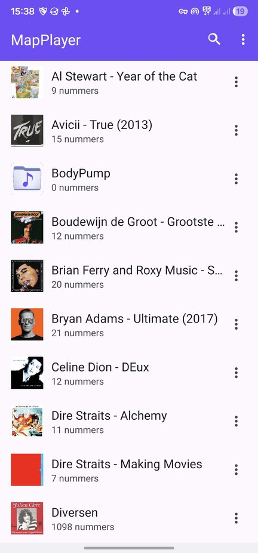
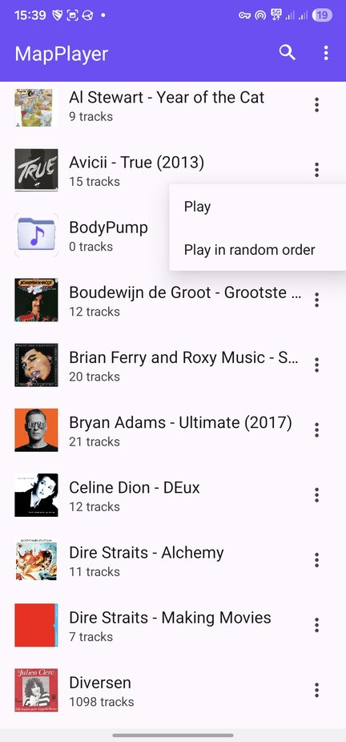
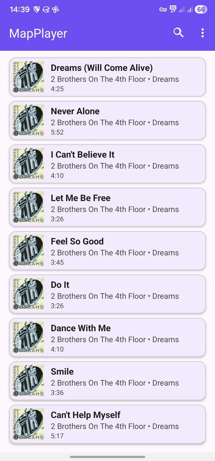
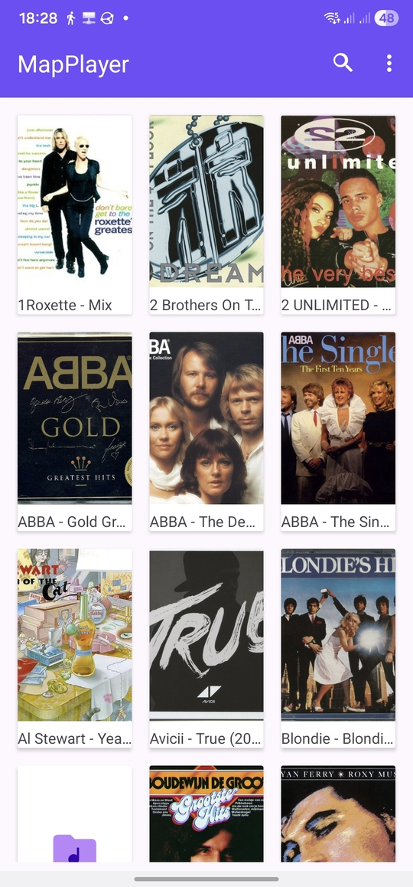
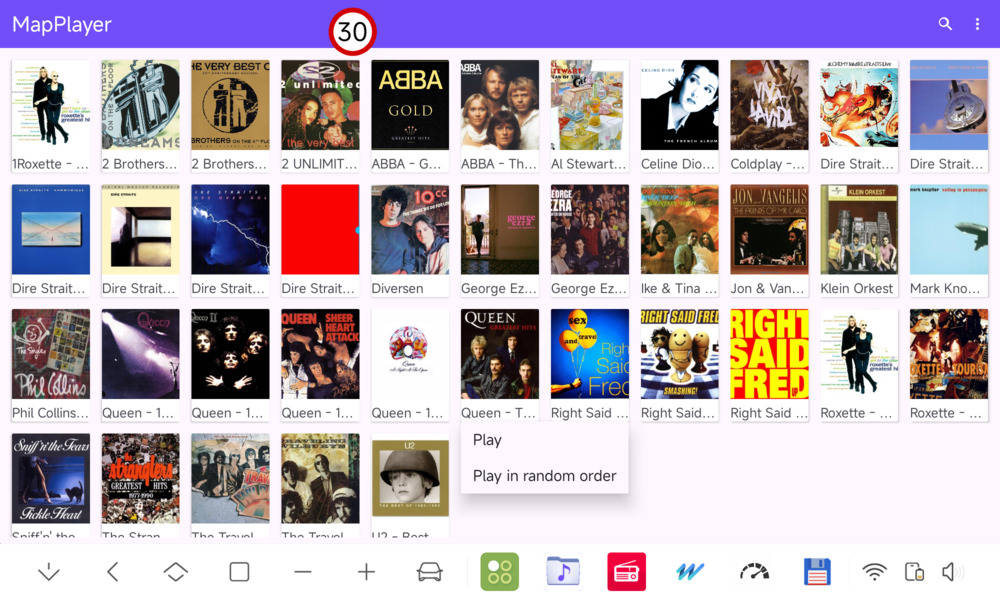
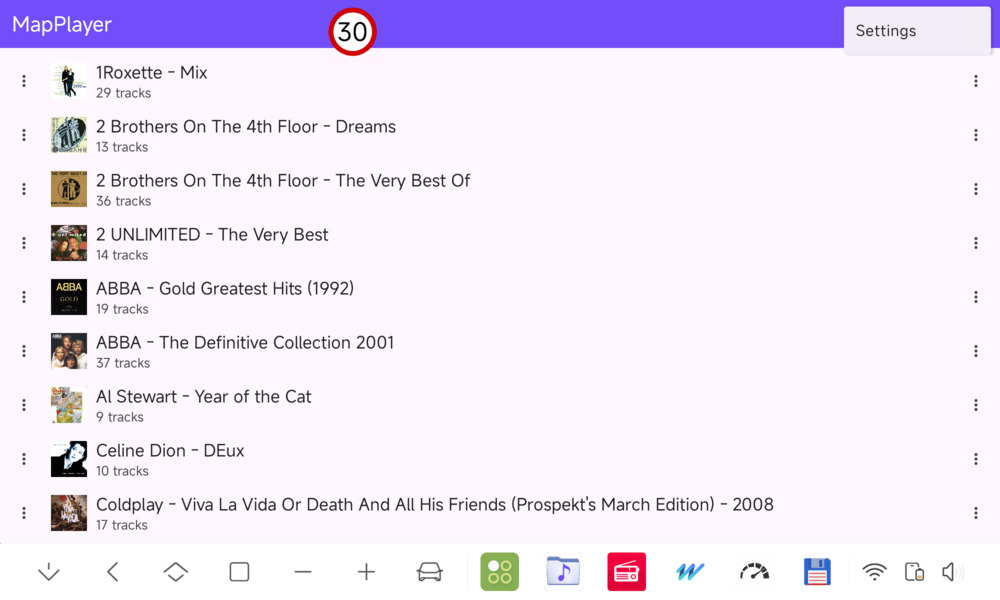
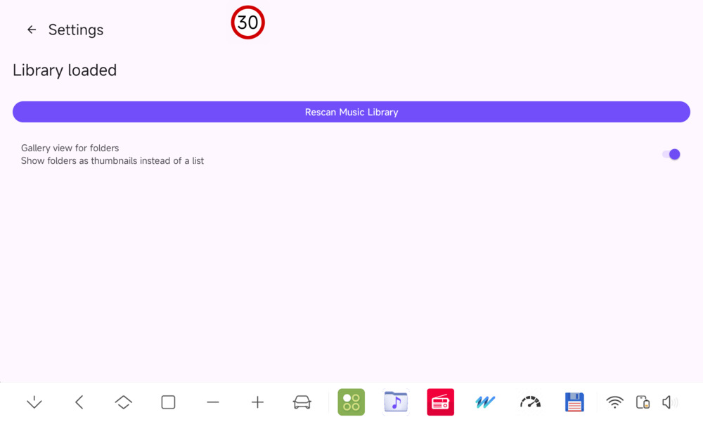

# MapPlayer

A folder-based only music player for Android based on the new Google [ExoPlayer](https://developer.android.com/media/media3/exoplayer) (not "old" MediaPlayer).

### Features
* Plays all audio files in a folder, sorted by filename (natural sorting)
* Regular file browser navigation
* After first start you need to do a (long) initial library scan. If you add new folders/files, modify files or remove files/folders, you need to do a rescan.
* If the library scan detects errors in your mp3 in metadata or audio or both, it will generate an error log which you can open and share after the scan.
* Shows album art
* Plays all Android supported formats (mp3/aac/flac, etc.)
* Play File, Play folder, Play folder in random order
* In List view: "More" menu (vertical 3-dots menu) for "Play folder" and "Play folder in random order", in landscape mode it has the "More" menu left and right of folder texts (Against all design rules but handy in widescreen Android car units).
* In Gallery view: tap folder icon to open the folder. Long-press icon to display popup menu with "Play folder" and "Play folder in random order".
* Settings for Gallery view: Select thumbanil size 256px, 384px or 512px (screenshot below shows 256px)
* Shuffle mode: Play folder in random order
* Search for a song/artist/album.
* Runs on Android 10+
* Material 3 theme
* MediaSession broadcasting to be used in widgets or [MediaOverlay](https://github.com/hvdwolf/MediaOverlay).
* No ads
* This app does not collect, store or share any personal information. It is 100% privacy friendly.

### Not-Features
* Only runs from "/storage/emulated/0/Music"
* No equalizer
* No repeat options
* No sorting options
* No favorites, no artist based or album based view or sorting, no playlists. Just folders with content.

### Disclaimer
I created this app entirely for myself and my wife. We have our entire collection in folders. We select a folder and use "Play" or "Play in random order". That's all. Repeat: That's all.  
If you find it useful, then use it and be happy. I will be too.  
I'm not going to implement any feature requests, unless I personally want/need them too.

### Some screenshots
Portrait images from my Samsung phone, landscape images from my DuDu7 Android head unit. The app should work on any Android device running Android 10+.

<table>
  <tr><th colspan="2">Some screenshots</th></tr>
  <tr>
     <td>Music folder view</td>
     <td>folder menu</td>
  </tr>
  <tr>
     <td></td>
     <td></td>
  </tr>
  <tr>
     <td>In folder view</td>
     <td>gallery view portrait</td>
  </tr>
  <tr>
     <td></td>
     <td></td>
  </tr>
  <tr>
     <td colspan="2">In folder view</td>
  </tr>
  <tr>
     <td colspan="2"></td>
  </tr>
  <tr>
     <td colspan="2">list view landscape</td>
  </tr>
  <tr>
     <td colspan="2"></td>
  </tr>
  <tr>
     <td colspan="2">library scan and listview/gallery switch</td>
  </tr>
  <tr>
     <td colspan="2"></td>
  </tr>

</table>